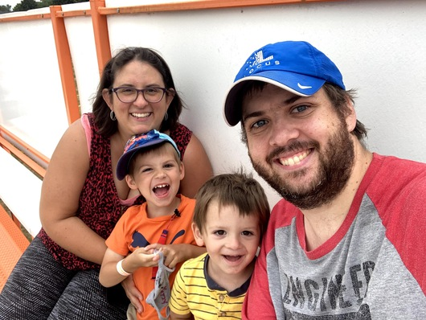

# About

Andrew has worked as a software engineer in the industrial and warehouse mobile robotics industry since 2013. He independently designed and developed real-time monitoring software that currently manages a fleet of _over ten thousand robots operating worldwide._

Today he leads a team of software engineers building mobile robot mapping, fleet configuration, and monitoring applications for web, dashboard, and mobile use in large warehouse spaces.

Most of his time is spent being a dad to two boys, which usually means getting into plenty of mischief. When he isn't doing that, he's likely at the piano, working on home renovations, or writing software for fun. He holds a BES and an MSc in Geography from the University of Waterloo.
