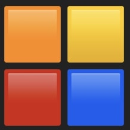

# Rubik

<time datetime="2024-03-09">2024-03-09</time>

I wrote a simple game based on a board game my kids love. This was mostly an experiment on using emojis as graphics assets.

[Check it out here](https://rubik.pointless.click)

[Source code](https://github.com/ablakey/rubik)

